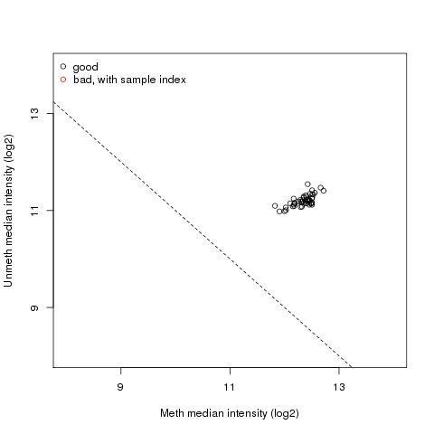
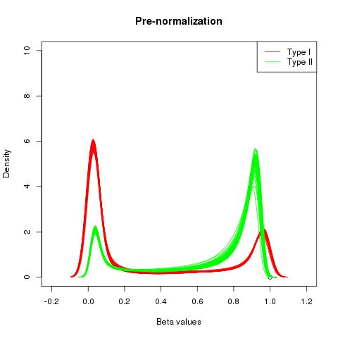
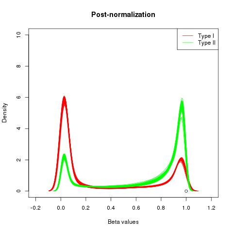

```{r setup, include=FALSE}
knitr::opts_chunk$set(echo=F, message=F, warning=F)
library(tidyverse)
library(knitr)
library(car)
library(jtools)
library(IlluminaHumanMethylationEPICanno.ilm10b2.hg19)
library(cowplot)
```

```{r load-data}
betas <- readRDS("../int/betas.qc.norm.filt.rds")

metadata <- read_csv("../data/phen/finalTbl_withCovariates_more.csv")
sampleSheet <- read_csv("../int/sampleSheet.csv")

load("../int/pca.RData")
cellCounts <- readRDS("../int/estCellCounts.rds")
load("../int/CPACOR.RData")
```

```{r clean-data}
mvals <- minfi::logit2(betas)

cellCounts <- as.data.frame(cellCounts) %>%
  rownames_to_column(var="sampleKey")

nmd <- metadata %>%  # nmd = "non-methylation data"
  mutate(responder=ifelse(K_responder_YN == "Yes", T, F)) %>%
  inner_join(sampleSheet, by="hnrcid") %>%
  mutate(sampleKey=paste(Sentrix_ID, Sentrix_Position, sep="_"),
         row=as.integer(substr(Sentrix_Position, 3, 3))) %>%
  inner_join(PCs, by="sampleKey") %>%
  inner_join(cellCounts, by="sampleKey") %>%
  inner_join(CP_PCs, by="sampleKey")
nmd <- nmd[match(colnames(betas), nmd$sampleKey), ]
stopifnot(all(nmd$sampleKey == colnames(betas)))

# epic_anno <- data.frame(getAnnotation(IlluminaHumanMethylationEPICanno.ilm10b2.hg19),
#                         stringsAsFactors=F) %>%
#   filter(!(chr %in% c("chrX", "chrY"))) %>%
#   mutate(chr=as.integer(gsub("chr", "", chr)))
```

# QC and preprocessing

First, we wanted to gain a basic confidence in the validity of the methylation data as returned from YCGA. A plot of microarray intensity values for methylated and unmethylated channels shows that no sample has grossly aberrant signal detection levels on the whole.

```{r intensity-plots}

```

QC steps involved removal of samples for which a notable proportion of probes were undetectable (none were removed), and removal of probes based on detection consistency across samples, associated SNPs, cross-hybridizing probes, non-CpG probes, and others.

The BMIQ normalization procedure was performed in order to approximately match methylation profiles between Type I (separate bead types for methylated vs. unmethylated) and Type II (single bead type for both) probes. The pre- and post-BMIQ plots confirm that it accomplished its intended effect.

```{r normalization-plots, out.width="50%"}


```

# PCA

PCA was used to investigate sample grouping with respect to large-scale patterns in the methylation data.

```{r pca-investigation, fig.asp=1.6}
bysex <- ggplot(nmd, aes(x=PC1, y=PC2, color=sex)) +
  geom_point()

byage <- ggplot(nmd, aes(x=PC1, y=PC2, color=age)) +
  geom_point()

byresponder <- ggplot(nmd, aes(x=PC1, y=PC2, color=K_responder_YN)) +
  geom_point() +
  scale_color_discrete(name="Responder")

bytrigs <- ggplot(nmd, aes(x=PC1, y=PC2, color=TRIG)) +
  geom_point()

bygrans <- ggplot(nmd, aes(x=PC1, y=PC2, color=Gran)) +
  geom_point()

byBF <- ggplot(nmd, aes(x=PC1, y=PC2, color=pctbfv0)) +
  geom_point()

plot_grid(bysex, byage, byresponder, bytrigs, bygrans, byBF,
          nrow=3, ncol=2)
```

PC1 from the beta-value matrix (~16% of variance explained) seems to load heavily on granulocytes (mostly made up of neutrophils). Sex seems to be related to PC2 (~7% variance explained).

# Outcome and covariate relationships

Additionally, before conducting any methylation-phenotype tests, we examined the correlations between various technical and biological variables and our outcome to understand covariate correlations and distributions.

```{r full-phenotype-model}
# summary(glm(responder ~ sex, data=nmd, family="binomial"))
# summary(glm(responder ~ age, data=nmd, family="binomial"))
# summary(glm(responder ~ pctbfv0, data=nmd, family="binomial"))
# summary(glm(responder ~ TRIG, data=nmd, family="binomial"))
# summary(glm(responder ~ statinsyn, data=nmd, family="binomial"))

all_model <- glm(responder ~ sex + age + pctbfv0 + statinsyn + TRIG, 
                 data=nmd, family="binomial")
plot_coefs(all_model) + ggtitle("Estimates from regression of responder status on covariates")
# vif(all_model)
```

<!--Note: Of the major variables we might expect to be relevant to downstream analyses, VIF values are ~4 for sex and body fat %.-->

```{r covariate-relationships, fig.asp=1.5}
nmd$responder <- as.numeric(nmd$responder)
nmd$sex <- nmd$M1F0
pairs(model.matrix(~.-1, select(nmd, responder, sex, age, TRIG, statinsyn, TRIG)))
```

Supplementary: same PCA plots but with control-probe PC1&2

```{r cp-pca-investigation, fig.asp=1.6}
bysex <- ggplot(nmd, aes(x=cpPC1, y=cpPC2, color=sex)) +
  geom_point()

byage <- ggplot(nmd, aes(x=cpPC1, y=cpPC2, color=age)) +
  geom_point()

byresponder <- ggplot(nmd, aes(x=cpPC1, y=cpPC2, color=K_responder_YN)) +
  geom_point() +
  scale_color_discrete(name="Responder")

bytrigs <- ggplot(nmd, aes(x=cpPC1, y=cpPC2, color=TRIG)) +
  geom_point()

bygrans <- ggplot(nmd, aes(x=cpPC1, y=cpPC2, color=Gran)) +
  geom_point()

byBF <- ggplot(nmd, aes(x=cpPC1, y=cpPC2, color=pctbfv0)) +
  geom_point()

plot_grid(bysex, byage, byresponder, bytrigs, bygrans, byBF,
          nrow=3, ncol=2)
```